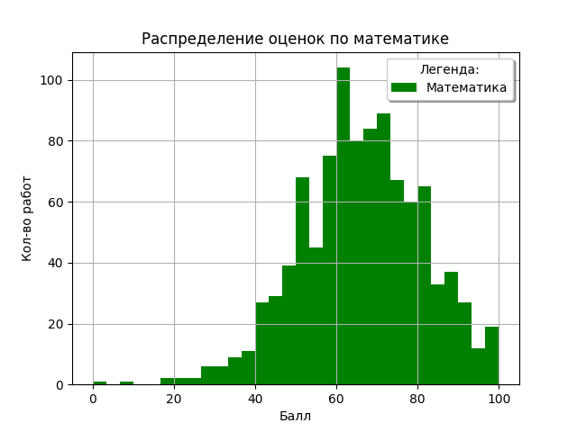
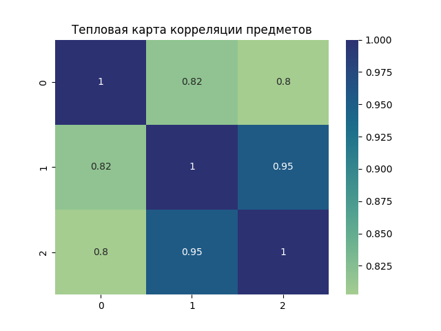
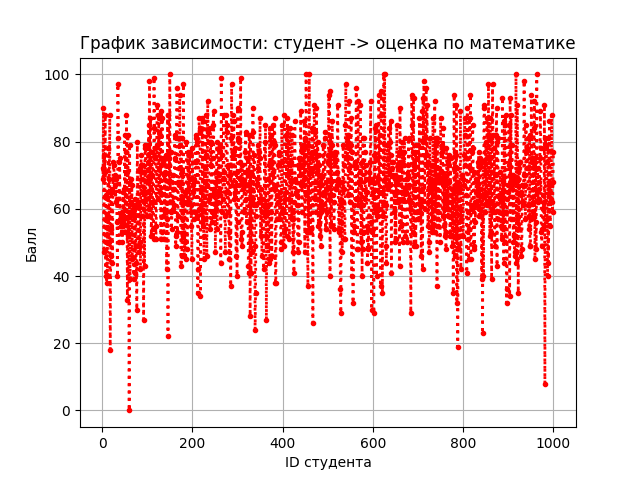
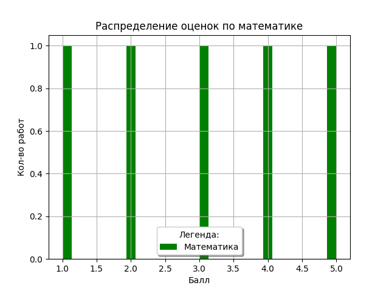
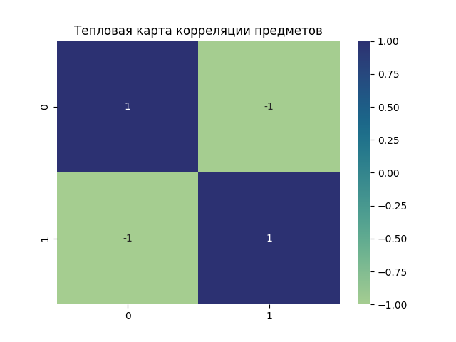
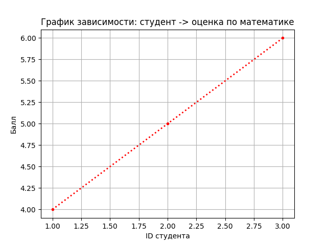

# Лабораторная работа №2: Основы NumPy: массивы и векторные операции

## **Цель работы**
- Освоить базовые операции создания и обработки массивов в библиотеке NumPy.
- Научиться выполнять векторные и матричные вычисления без использования циклов (векторизация).
- Изучить методы статистического анализа данных: расчёт среднего, медианы, стандартного отклонения, перцентилей.
- Реализовать нормализацию данных по формуле Min-Max.
- Освоить визуализацию данных с использованием Matplotlib и Seaborn.
- Закрепить навыки работы с виртуальными окружениями, тестирования через pytest и организации структуры проекта.

---

## **Основная часть**

### Структура проекта:
```
numpy_lab/
├── main.py          # Реализация функций
├── test.py          # Юнит-тесты на pytest
├── data/            # Исходные данные
│   └── students_scores.csv  
│   └── StudentsPerformance.csv
└── plots/           # Папка для сохранения графиков
```

### Подготовка окружения и структуры проекта
```bash
# Создание виртуального окружения
python -m venv .venv

# Активация 
source .venv/bin/activate

# Установка зависимостей
pip install numpy matplotlib seaborn pandas pytest
```

### Реализованные функции

**1. Работа с массивами: создание, преобразование, базовые операции**

| Задача | Описание | 
|--------|----------|
| `create_vector()` | Создать вектор `[0, 1, ..., 9]` | 
| `create_matrix()` | Матрица 5×5 со случайными числами |
| `reshape_vector()` | Преобразовать `(10,)` → `(2, 5)` |
| `transpose_matrix()` | Транспонирование матрицы |

_Реализация:_
```python
def create_vector() -> np.ndarray:
    return np.arange(0, 10, 1)

def create_matrix() -> np.ndarray:
    return np.random.rand(5, 5)

def reshape_vector(vec) -> np.ndarray:
    return vec.reshape(2, 5)

def transpose_matrix(mat) -> np.ndarray:
    return np.transpose(mat)
```

---

**2. Векторные операции**

| Задача | Описание | 
|--------|----------|
| `vector_add(a, b)` | Сложение векторов одинаковой длины |
| `scalar_multiply(vec, scalar)` | Умножение вектора на число |
| `elementwise_multiply(a, b)` | Поэлементное умножение |
| `dot_product(a, b)` | Скалярное произведение |

_Реализация:_
```python
def vector_add(a, b) -> np.ndarray:
    return a + b  

def scalar_multiply(vec: np.ndarray, scalar: int) -> np.ndarray:
    return vec * scalar

def dot_product(a: np.ndarray, b: np.ndarray) -> float:
    return np.dot(a, b)  
```

---

**3. Матричные операции**

| Задача | Описание | 
|--------|----------|
| `matrix_multiply(a, b)` | Умножение матриц | 
| `matrix_determinant(a)` | Определитель матрицы | 
| `matrix_inverse(a)` | Обратная матрица | 
| `solve_linear_system(a, b)` | Решить систему Ax = b | 

_Реализация:_
```python
def matrix_multiply(a: np.ndarray, b: np.ndarray) -> np.ndarray:
    return np.matmul(a, b)  

def matrix_determinant(a: np.ndarray) -> float:
    return np.linalg.det(a)

def matrix_inverse(a: np.ndarray) -> np.ndarray:
    return np.linalg.inv(a)

def solve_linear_system(a: np.ndarray, b: np.ndarray) -> np.ndarray:
    return np.linalg.solve(a, b) 
```

---

**4. Статистический анализ**

| Задача | Описание | 
|--------|----------|
| `load_dataset(path)` | Загрузить CSV в NumPy массив | 
| `statistical_analysis(data)` | Рассчитать статистику | 
| `normalize_data(data)` | Min-Max нормализация | 

**Статистические метрики:**  
- **mean** — среднее значение  
- **median** — медиана (50-й перцентиль)  
- **std** — стандартное отклонение  
- **min/max** — минимальное/максимальное значение  
- **25percentile** — первый квартиль  
- **75percentile** — третий квартиль  

_Реализация:_
```python
def statistical_analysis(data: np.ndarray) -> dict:
    return {
        "mean": np.mean(data),
        "median": np.median(data),
        "std": np.std(data),
        "min": np.min(data),
        "max": np.max(data),
        "25percentile": np.percentile(data, 25),
        "75percentile": np.percentile(data, 75)
    }

def normalize_data(data: np.ndarray) -> np.ndarray:
    return (data - np.min(data)) / (np.max(data) - np.min(data))  
```

---

**5. Визуализация данных**

| Задача | Описание | 
|--------|----------|
| `plot_histogram(data)` | Гистограмма распределения | 
| `plot_heatmap(matrix)` | Тепловая карта корреляции | 
| `plot_line(x, y)` | Линейный график | 

_Реализация:_
```python
def plot_histogram(data: np.ndarray):
    plt.hist(data, bins=30, color="green", label="Математика")
    plt.title('Распределение оценок по математике')
    plt.xlabel("Балл")
    plt.ylabel("Кол-во работ")
    plt.grid(True)
    plt.legend()
    plt.savefig("plots/histogram.png")
    plt.show()

def plot_heatmap(matrix: np.ndarray):
    sns.heatmap(np.corrcoef(matrix.astype(float), rowvar=False), 
                cmap="crest", annot=True)
    plt.title("Тепловая карта корреляции предметов")
    plt.savefig("plots/heatmap.png")
    plt.show()

def plot_line(x: np.ndarray, y: np.ndarray):
    plt.plot(x, y, 'r.:', linewidth=2)
    plt.title("График зависимости: студент -> оценка по математике")
    plt.xlabel("ID студента")
    plt.ylabel("Балл")
    plt.grid(True)
    plt.savefig("plots/line.png")
    plt.show()
```

### **Результаты построения графиков:**







## Тестирование 

Для запуска тестов в терминале нужно запустить:

```bash
python3.12 -m pytest test.py -v
```

### **Результаты тестирования**

```bash
================================================= test session starts ==================================================
platform darwin -- Python 3.12.10, pytest-9.0.2, pluggy-1.6.0 -- /Users/artemgolubev/Programming/Python_ITMO_Education/2 semestr/lab_2/.venv/bin/python3.12
cachedir: .pytest_cache
rootdir: /Users/artemgolubev/Programming/Python_ITMO_Education/2 semestr/lab_2
collected 17 items                                                                                                     

test.py::test_create_vector PASSED                                                                               [  5%]
test.py::test_create_matrix PASSED                                                                               [ 11%]
test.py::test_reshape_vector PASSED                                                                              [ 17%]
test.py::test_vector_add PASSED                                                                                  [ 23%]
test.py::test_scalar_multiply PASSED                                                                             [ 29%]
test.py::test_elementwise_multiply PASSED                                                                        [ 35%]
test.py::test_dot_product PASSED                                                                                 [ 41%]
test.py::test_matrix_multiply PASSED                                                                             [ 47%]
test.py::test_matrix_determinant PASSED                                                                          [ 52%]
test.py::test_matrix_inverse PASSED                                                                              [ 58%]
test.py::test_solve_linear_system PASSED                                                                         [ 64%]
test.py::test_load_dataset PASSED                                                                                [ 70%]
test.py::test_statistical_analysis PASSED                                                                        [ 76%]
test.py::test_normalization PASSED                                                                               [ 82%]
test.py::test_plot_histogram PASSED                                                                              [ 88%]
test.py::test_plot_heatmap PASSED                                                                                [ 94%]
test.py::test_plot_line PASSED                                                                                   [100%]

================================================== 17 passed in 3.26s ==================================================
```

### **Графики, построенные во время тестов**







## **Выводы**

**В ходе выполнения лабораторной работы:**  

- Освоены основы работы с массивами NumPy и построения  
графиков matplotlib и seaborn🙃  
- Реализованы векторные и матричные операции 😎  
- Получены базовые навыки статистического анализа 🤯  
- Все 17 тестов пройдены успешно 😦 

## **Исходный код**

Полное решение можно найти в моём [репозитории](https://github.com/slw0000/Python_ITMO_Education/tree/main/2%20semestr/lab_2)


